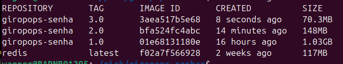

# PICK-2024
programa internsivo de containers e kubernets 

<h1>
  
</h1>

clonar aplicação 
#git clone https://github.com/badtuxx/giropops-senhas.git

entrar no diretorio 
cd giropops-senhas/

Criar Dockerfile 
vim Dockerfile
---------------------------------
FROM python:3.11
WORKDIR /app
COPY requirements.txt .
COPY app.py .
COPY templates templates/
COPY static static/

RUN pip install --no-cache-dir -r requirements.txt
EXPOSE 5000

CMD ["flask", "run", "--host=0.0.0.0"]
-------------------------------------------------------

rodar aplicação e setar ip local para rodar REDIS junto 
docker run -d --name giropops-senhas -p 5000:5000 --env REDIS_HOST=192.168.10.64 giropops-senha:1.0

<h1>
  
</h1>

rodar Redis 
docker run -d --name redis -p 6379:6379 redis

alterando a imagem 
FROM python:3.11-slim
docker build -t giropops-senha:2.0 .

<h1>
  
</h1>

alterando a imagem 
FROM python:3.11.4-alpine3.18
docker build -t giropops-senha:3.0 .
-------------------------------------------------------
docker build -t giropops-senha:4.0 .

imagem distroless

FROM cgr.dev/chainguard/python:latest-dev
WORKDIR /app
COPY requirements.txt .
# Instalação sem --user
RUN pip install --no-cache-dir -r requirements.txt
COPY app.py .
COPY templates templates/
COPY static static/
EXPOSE 5000
# Usando python -m flask
ENTRYPOINT ["python", "-m", "flask", "run", "--host=0.0.0.0", "--debug"]
---------------------------------------------------------------

multistage
# Primeira etapa (build)
FROM cgr.dev/chainguard/python:latest-dev as dev
WORKDIR /app
# Criando um ambiente virtual no Python
RUN python -m venv venv
# Definindo o PATH para utilizar o ambiente virtual
ENV PATH="/app/venv/bin":$PATH
# Copiando e instalando dependências
COPY requirements.txt .
RUN pip install --no-cache-dir -r requirements.txt
# Segunda etapa (produção)
FROM cgr.dev/chainguard/python:latest
WORKDIR /app
# Copiando apenas o código necessário
COPY app.py .
COPY templates templates/
COPY static static/
# Copiando o ambiente virtual da primeira etapa
COPY --from=dev /app/venv /app/venv
# Definindo o PATH para utilizar o ambiente virtual na etapa final
ENV PATH="/app/venv/bin:$PATH"
# Expondo a porta da aplicação Flask
EXPOSE 5000
# Definindo o comando de inicialização da aplicação Flask
ENTRYPOINT ["python", "-m", "flask", "run", "--host=0.0.0.0", "--debug"]

docker build -t giropops-senha:5.0 .

docker run -d --name giropops-senhas -p 5000:5000 --env REDIS_HOST=172.30.1.28 giropops-senha:5.0

<h1>
  
</h1>

-----------------------------------------------------------------
#Instalar TRIVY 

sudo apt-get install wget apt-transport-https gnupg lsb-release
wget -qO - https://aquasecurity.github.io/trivy-repo/deb/public.key | sudo apt-key add -
echo deb https://aquasecurity.github.io/trivy-repo/deb $(lsb_release -sc) main | sudo tee -a /etc/apt/sources.list.d/trivy.list
sudo apt-get update
sudo apt-get install trivy
-------------------------------------------------------
#comandos trivy 
trivy image giropops-senhas:1.0

#Verificar as ultimas linhas 
trivy image giropops-senhas:1.0 | head -n 20

#Verificar fase a fase devagar 
trivy image --scanners vuln giropops-senhas:4.0

---------------------------------------------------------------
#Install cosign 
curl -O -L "https://github.com/sigstore/cosign/releases/latest/download/cosign-linux-amd64"
sudo mv cosign-linux-amd64 /usr/local/bin/cosign
sudo chmod +x /usr/local/bin/cosign

#se der erro fazer passo a passo 

#Gerando key-pair
cosign generate-key-pair
#escolha uma senha de sua escolha e a repita no proximo passo 
#será gerado .key e .pub 
#Assinando a imagem 
cosign sign -key cosign.key giropops-senhas:1.0
#coloca a senha gerada na etapa anterior 
#porem a imagem tem que estar em um registry

